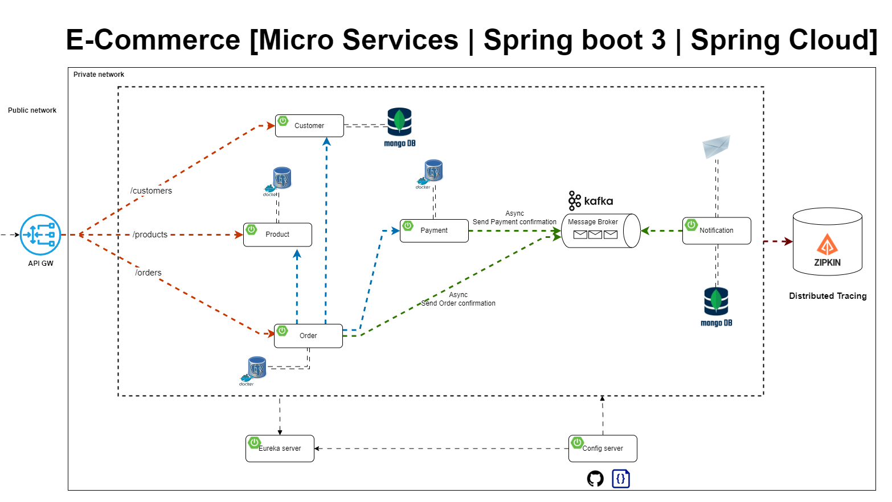

# 🛒 Microservice E-commerce Platform

A **scalable and distributed** e-commerce platform built with **Spring Boot microservices**, following **Domain-Driven Design (DDD)** principles and **Zipkin** for distributed tracing

## Domain Driven Design

## Overview Architecture

## Asynchronous Communication

